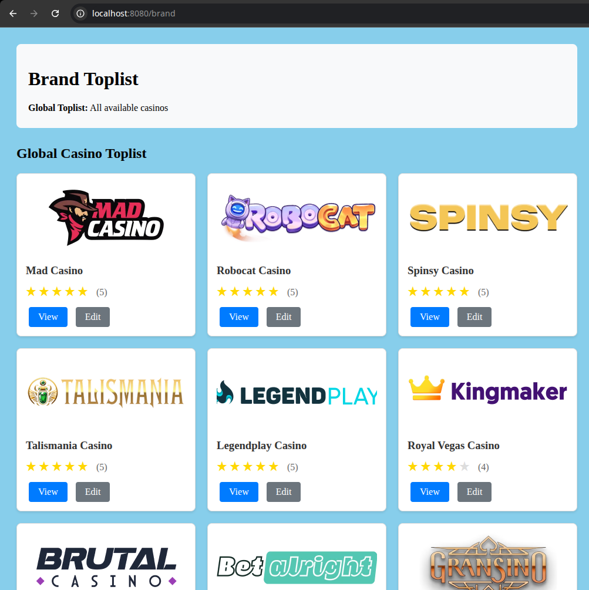

# Casino Brand Toplist Application

A CRUD application for managing casino brands with geolocation-based toplist configuration. Built with Symfony 7, PHP 8.3, and Docker.

## Preview


## Features

- Full CRUD operations for casino brands
- Unified RESTful API and web interface endpoints
- Comprehensive data validation
- Geolocation-based toplist using Cloudflare CF-IPCountry header
- Mobile-responsive frontend
- Docker containerization
- PostgreSQL database with migrations
- Data fixtures with real casino images

## Quick Start

### Requirements

- Docker
- Docker Compose
- Git

### Setup

1. Clone the repository
2. Start the application

   ```bash
   docker-compose up -d
   ```

3. Open http://localhost:8080 in your browser

4. Load fixtures

   ```bash
    docker-compose exec php php bin/console doctrine:fixtures:load --no-interaction
   ```

5. navigate to http://localhost:8080/brand/fake-header/BG

## API Routes

The app uses unified endpoints that detect whether to return JSON (API) or HTML (web interface) based on request headers.

### Unified Endpoints

- `GET /brand` - List all brands (filtered by geolocation)
  - Returns HTML page by default
  - Returns JSON when `Accept: application/json` header is set
- `GET /brand/{id}` - Get specific brand details
- `POST /brand/new` - Create new brand
- `PATCH /brand/{id}/edit` - Update existing brand
- `DELETE /brand/{id}` - Delete brand

### Geolocation Testing

The application automatically detects user 
location using the `CF-IPCountry` HTTP header 
from Cloudflare:

- **Country detected**: Shows brands filtered 
by country code
- **No country detected**: Shows global toplist 
with all available casinos
- **Supported format**: ISO-2 country codes 
(BG, US, UK, etc.)

- `GET /brand/fake-header/{countryCode}` - Test geolocation with fake country header
  - Example: `/brand/fake-header/BG` for Bulgaria
  - Example: `/brand/fake-header/US` for United States

  Use the fake-header route to test different country scenarios:

  1. **Bulgaria**: http://localhost:8080/brand/fake-header/BG
  2. **United States**: http://localhost:8080/brand/fake-header/US
  3. **Invalid country**: http://localhost:8080/brand/fake-header/XYZ


